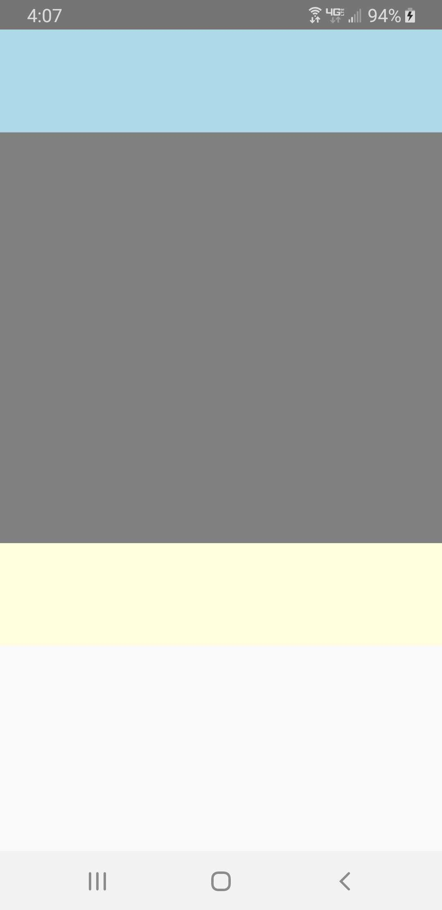
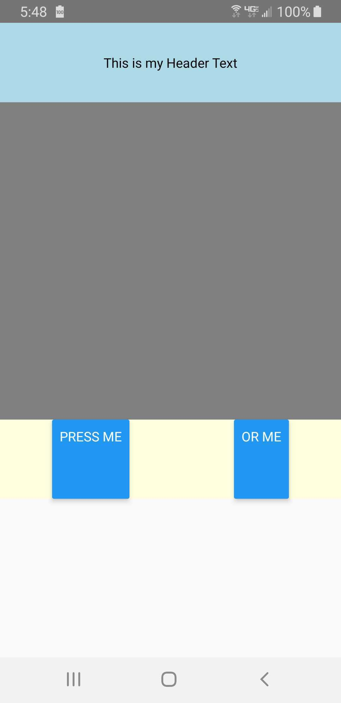
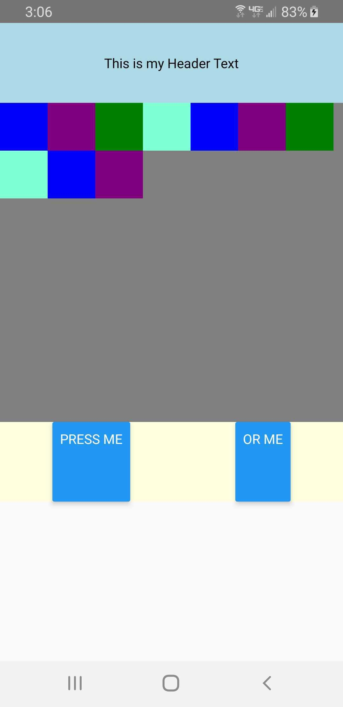
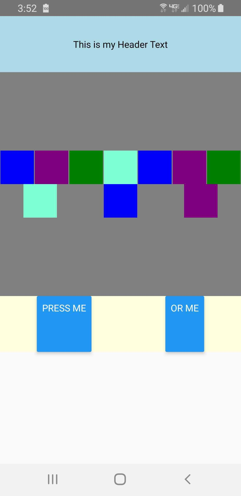
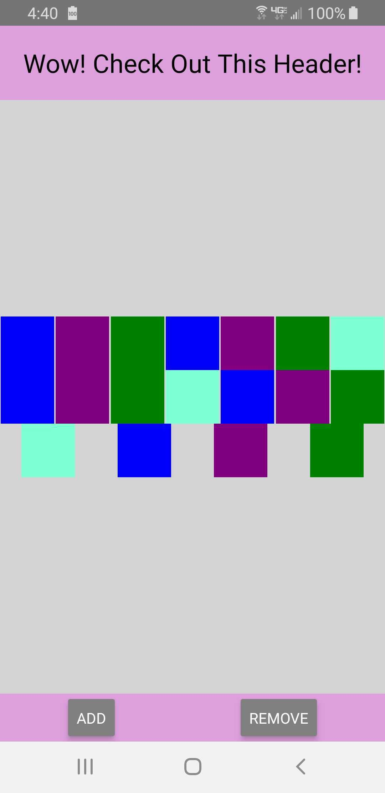

## Create a Grid Layout Using React Native View and StyleSheet
Creating sections within a parent view is as easy as setting the flex style attribute of the children. Create a child view for each section and set the flex attribute to a single integer marking it's ratio of the overall parent view size.  For instance, if you want 3 equally sized sections, set `flex: 1` for each view.

The code below is where I started.  This creates a parent view which covers 75% of the screen height.  Within this parent view are three children; the header, main, and footer sections.  By setting the flex attributes this way, the header and footer are both 1/6th the size of the parent, while the main section is 4/6ths the size.

```import React from 'react';
import { View, StyleSheet } from 'react-native';

const App: () => React$Node = () => {
  return (
    <View style={styles.page}>
      <View style={styles.headerSection}></View>
      <View style={styles.mainSection}></View>
      <View style={styles.footerSection}></View>
    </View>
  );
};

const styles = StyleSheet.create({
  page: {
    width: '100%',
    height: '75%'
  },
  headerSection: {
    flex: 1,
    backgroundColor: 'lightblue'
  },
  mainSection: {
    flex: 4,
    backgroundColor: 'grey'
  },
  footerSection: {
    flex: 1,
    backgroundColor: 'lightyellow'
  }
});

export default App;
```
By setting background colors on each section, it is easy to see where each section starts and ends.

</img>

Once I had a basic layout, I could add children to each of the sections, creating nested grids and controlling the placement of text with just a few style attributes. To control the placement of text in the header view, use `justifyContent` and `alignItems` otherwise the default placement is top and left. To add two evenly spaced buttons to the footer, use `justifyContent: 'space-around'` and `flexDirection: 'row'`.

Here is the modified JSX:
```
<View style={styles.page}>
  <View style={styles.headerSection}>
    <Text>This is my Header Text</Text>
  </View>
  <View style={styles.mainSection}></View>
  <View style={styles.footerSection}>
    <Button title='Press Me'></Button>
    <Button title='Or Try Me'></Button>
  </View>
</View>
```
And the modified style:
```
  },
  headerSection: {
    flex: 1,
    backgroundColor: 'lightblue',
    justifyContent: 'center',
    alignItems: 'center'
  },
  mainSection: {
    flex: 4,
    backgroundColor: 'grey'
  },
  footerSection: {
    flex: 1,
    backgroundColor: 'lightyellow',
    flexDirection: 'row',
    justifyContent: 'space-around'
  }
});
```
The result is not necessarily pretty but shows how to create a layout with only a handful of style attributes (flex, flexDirection, justifyContent, and alignItems)

</img>

For the main section, I experimented with a layout to handle a random number of children.  For example, a picture gallery application should be able to display 0 to many pictures.  The layout can adjust to fit new pictures or children and shrink to size when pictures or children are removed. For this, I learned more about the `alignContent` and `flexWrap` attributes.

By default, `flexWrap: 'nowrap'` which means if there are more children than can fit in one column or row, the children overflow the view. Set `flexWrap: 'wrap'` to have those extra children wrap to another column or row to fit in view.

</img>

The attribute `alignContent` is used to set the style of the wrapping line(s) of children views.  If set to `flex-start` (default), `center`, or `flex-end`, the set of lines are placed at the appropriate spot in the parent view.  If `flexDirection: 'row'`, that would be top, center (vertically), or bottom of parent view, respectively.  If `flexDirection: 'column'` it would be left, center (horizontally), or right, respectively.  `alignContent` handles alignment along the cross axis while `justifyContent` handles alignment along the main axis; horizontal when `flexDirection: 'row'` and vertical when `flex-direction: 'column'`.

I went with something more centered and even spaced by changing my main section style to the following:
```
mainSection: {
  flex: 4,
  backgroundColor: 'grey',
  flexDirection: 'row',
  flexWrap: 'wrap',
  alignContent: 'center',
  justifyContent: 'space-around'
}
```
By setting `alignContent: 'center'`, the group of lines sits vertically centered and with `justifyContent: 'space-around'`, the children are spaced evenly in their rows.

</img>

Finally, I prettied it up (or at least as pretty as I can in a few minutes) and made it interactive.  The first button adds a child view and the second button removes one from the main section.  Here is the final screen shot and the code below.

</img>

```
import React, { useState } from 'react';
import { View, StyleSheet, Text, Button } from 'react-native';

const App: () => React$Node = () => {

  const colors = ['blue', 'purple', 'green', 'aquamarine'];
  let initItems = [];
  for (let i = 0; i < 10; i++) {
    let color = colors[i % 4];
    initItems.push({id: i, color: color});
  }
  const [items, setItems] = useState(initItems);

  const getItems = () => {
    return items.map(item => (
      <View key={item.id} style={{width: 50, height: 50, backgroundColor: item.color}}></View>
    ));
  }

  const handleAdd = () => {
    let newItems = items.slice();
    const colorIdx = (newItems.length + 1) % 4;
    newItems.push({id: newItems.length + 1, color: colors[colorIdx]});
    setItems(newItems);
  }

  const handleRemove = () => {
    let newItems = items.slice();
    newItems.pop();
    setItems(newItems);
  }

  return (
    <View style={styles.page}>
      <View style={styles.headerSection}>
        <Text style={styles.headerText}>Wow! Check Out This Header!</Text>
      </View>
      <View style={styles.mainSection}>
        {getItems()}
      </View>
      <View style={styles.footerSection}>
        <Button color='grey' onPress={handleAdd} title='Add'></Button>
        <Button color='grey' onPress={handleRemove} title='Remove'></Button>
      </View>
    </View>
  );
};

const styles = StyleSheet.create({
  page: {
    width: '100%',
    height: '100%'
  },
  headerSection: {
    flex: 0.5,
    backgroundColor: 'plum',
    justifyContent: 'center',
    alignItems: 'center'
  },
  headerText: {
    fontSize: 24,
    padding: 5
  },
  mainSection: {
    flex: 4,
    backgroundColor: 'lightgrey',
    flexDirection: 'row',
    flexWrap: 'wrap',
    alignContent: 'center',
    justifyContent: 'space-around'
  },
  footerSection: {
    flex: 0.25,
    backgroundColor: 'plum',
    flexDirection: 'row',
    justifyContent: 'space-around',
    padding: 5
  }
});

export default App;
```
